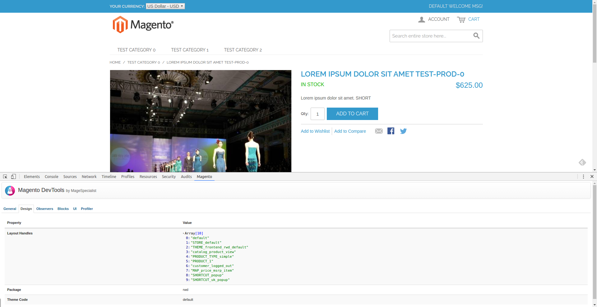
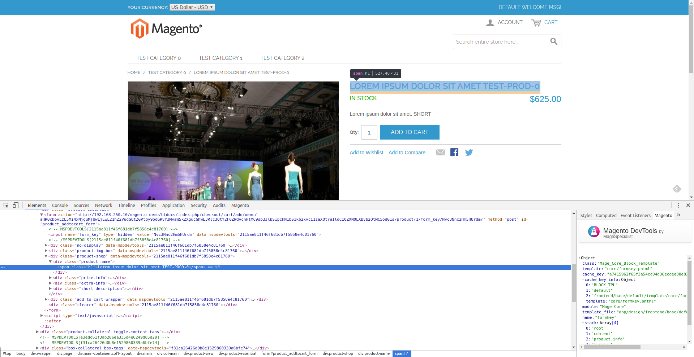

# MageSpecialist DevTools for Magento 1

This module is intended to be used with **MageSpecialist Chrome Toolbar**. 
Readme and installation guide can be found here: https://github.com/magespecialist/mage-chrome-toolbar

> This module is also available for **Magento 2**: https://github.com/magespecialist/m2-MSP_DevTools/

## Installing on Magento 1:
Please refer to this page: https://github.com/magespecialist/mage-chrome-toolbar/wiki

## Screenshot

#### General informations:

#### Design informations: 

#### Observers informations:

#### Block informations:

#### Profiler information:

#### Inspector integration

